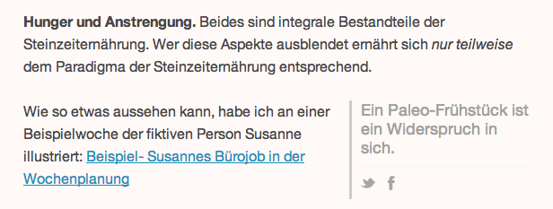

# Pullquote Plugin

This is a Wordpress plugin to create shareable pullquotes with the `[pullquote]` shortcode.

It's based on [RealTidbits PushQuote plugin](http://wordpress.org/plugins/pushquote/).  I put non-style data into HTML `data` attributes instead of polluting the DOM's CSS classes.

## Usage

Simply use the `[pullquote]` shortcode to **duplicate** the selected text as a pullquote.  The original will remain in your post's body text.

    Here will be [pullquote]some highlighted text[/pullquote]

### Show quote only/hide original text

If you want to provide a pullquote without duplicating the quote's text, for example when you want to insert a catchy phrase your visitor's should stumble upon, hide the original with `hidden="true"`:

    [pullquote hidden="true"]Awesome stuff not visible in the main body font![/pullquote]

### Change pullquote's positions

You can specify the pullquote's position with the `position` attribute.  It takes the values `right` and `left`:

    Here will be [pullquote position="right"]highlighted text to the right[/pullquote]

# License

PullQuote (C) 2013 Christian Tietze  
PushQuote Copyright (C) RealTidbits (http://wordpress.org/plugins/pushquote/)

This program is free software; you can redistribute it and/or modify it under the terms of the GNU General Public License as published by the Free Software Foundation; either version 2 of the License, or (at your option) any later version.

This program is distributed in the hope that it will be useful, but WITHOUT ANY WARRANTY; without even the implied warranty of MERCHANTABILITY or FITNESS FOR A PARTICULAR PURPOSE. See the GNU General Public License for more details.

You should have received a copy of the GNU General Public License along with this program; if not, write to the Free Software Foundation, Inc., 59 Temple Place, Suite 330, Boston, MA 02111-1307 USA